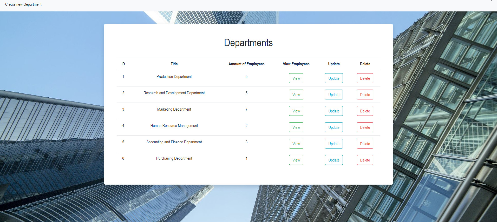
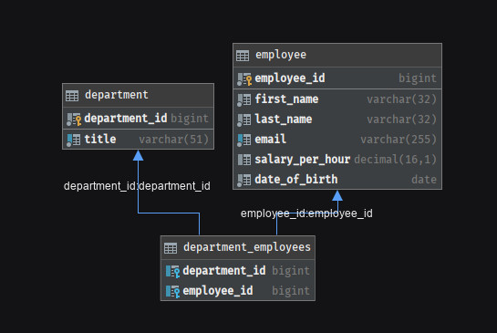
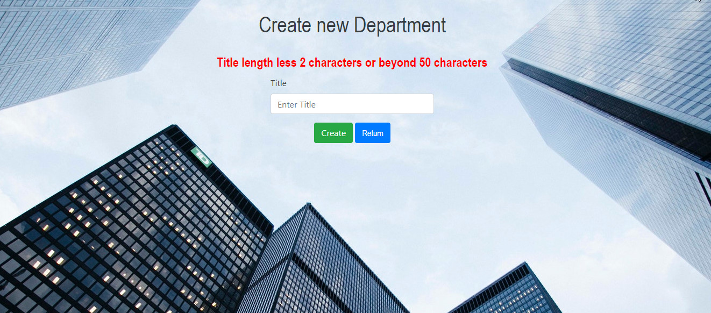
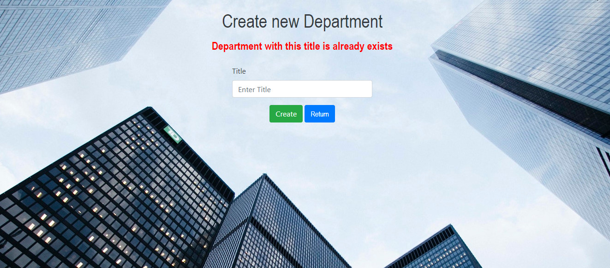
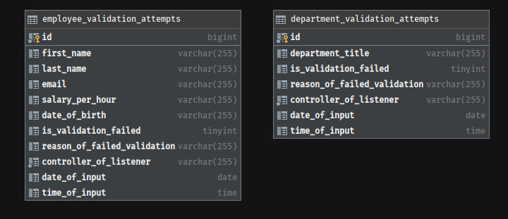
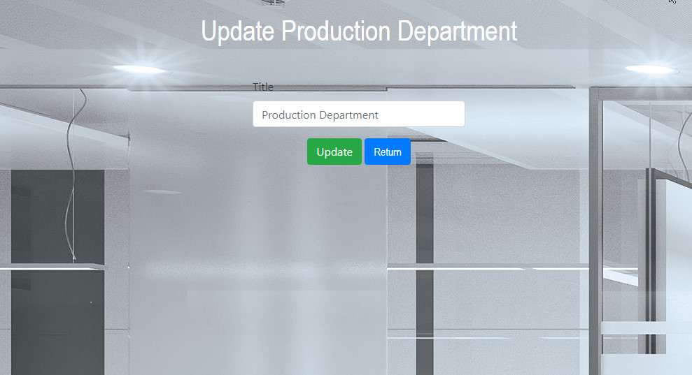
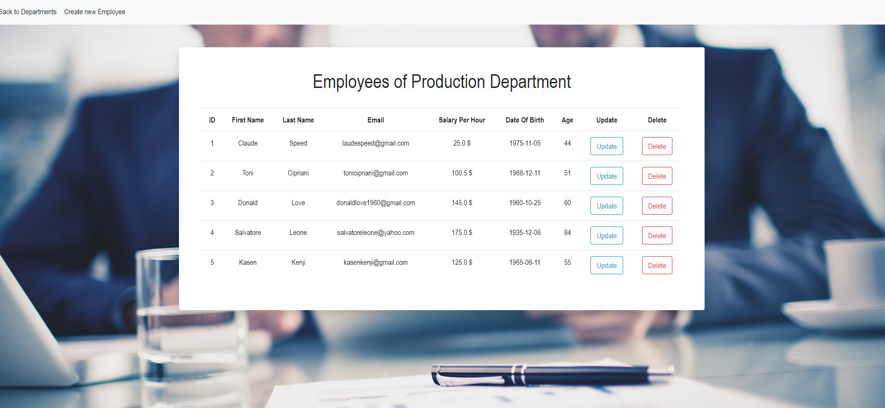

# Java Trainee тестовое задание для Aimprosoft.


# Содержание
[Предисловие](#foreword)<br>

[Пункт 0](#paragraph_0)<br>
[Пункт 1](#paragraph_1)<br>
[Пункт 2](#paragraph_2)<br>
[Пункт 3](#paragraph_3)<br>
[Пункт 4](#paragraph_4)<br>
[Пункт 5](#paragraph_5)<br>
[Пункт 6](#paragraph_6)<br>
[Пункт 7](#paragraph_7)<br>
[Пункт 8](#paragraph_8)<br>
[Для разработчиков](#developer-start)<br>
[Автор](#authors)


# <a name="foreword"></a>Предисловие
Мне удалось  выполнить все требования к тестовому заданию, ниже представлен полный функционал приложения где по пунктам будет рассказаны и показаны задачи и корректность их работы.


# <a name="paragraph_0"></a>Пункт 0
```yaml
  Условие. Есть сотрудники и департаменты. 
  У департамента может быть много сотрудников. А может и не быть.
```
Реализовал через ManyToMany где имеются три таблицы employee, department, department_employees.

Первые две предсталяют собой обычные модели, третья содержит в себе только ID (PRIMARY KEY) сотрудников и департаментов.

(смотреть) [database_initialization.sql](src/main/resourses/sql/database_initialization.sql)



# <a name="paragraph_1"></a>Пункт 1
```yaml
 1. БД -jdbc
```
Это приложение взаимодействует с БД исключительно через JDBC. (никаких Hibernate, Spring Data ...)


# <a name="paragraph_2"></a>Пункт 2
```yaml
 2. Controller – servlet 
```
Все согласно ТЗ.


# <a name="paragraph_3"></a>Пункт 3
```yaml
 3. View – jsp+el+jstl 
```
От себя добавил так же css, был в планах Bootstrap, но не успеваю.


# <a name="paragraph_4"></a>Пункт 4
```yaml
 4. Валидация данных.
```

Начнем пожалуй с департаментов.
1. Вы сможете создать новый департамент только в случае, если придерживаетесь следующих правил, а именно :


```yaml
 Длина названия Департамента должна иметь от 2 до 50 симолов. Название может включать в себя цифры.
```



```yaml
 Название Департамента должно быть уникально, это значит что вы не можете создать новый Департамент с названием, которое уже имеет другой Департамент.
```



```yaml
 - Обратите внимание, порядок регистра и начальные и конечные пробелы не учитываются. 
    Это значить что AWS Department и ... AwS DeparTment... будут эквивалентны и вы не сможете создать новую сущьность.
```
Валидация происходить как на уровне БД, так и на уровне Servlet.

В БД это выражается через ключевое слово UNIQUE.

В Servlet через метод anyMatch() за ~ O(n) мы проходим все элементы и через .trim().equalsIgnoreCase сравниваем title. 

В случае если результатом операции будет true, в JSP начинает работать registrationFormAlert.


Теперь к сотрудникам, все работает аналогичным образом.


```yaml
 Длина имени или фамилии сотрудника должна иметь от 2 до 30 симолов. НЕ может включать в себя цифры.
```


```yaml
 Email должен быть валидным. Создал специальный класс для подобных операций
 - Email у сотрудника так же уникален как и название у Департамента, так же валидация на уровне БД и Servlet.
```
(смотреть) [Helper](src/main/java/com/task/core/Helper.java) , [EmailValidatorTest](src/main/test/EmailValidatorTest.java) 


```yaml
 Salary Per hour должен состоять только из цифр
```

```yaml
 День Рождения сотрудника, обратите внимание, в классе Helper есть также метод для подсчёта возраста, который должен быть минимум 18 лет.
```


# <a name="paragraph_5"></a>Пункт 5
```yaml
  Уникальность имени у департамента и мыла у пользователя. 
```
Данные значения уникальны для сущностей, невозможно CREATE или UPDATE к аналогичному UNIQUE какой-то другой сущоности.

# <a name="paragraph_6"></a>Пункт 6
```yaml
  У сотрудника обязательно одно поле - числовое, одно — дата. 
```
Под числовым я выбрал Salary Per Year, под датой DayOfBirth/

# <a name="paragraph_7"></a>Пункт 7
```yaml
  Данные после валидации пропадать не должны, даже если они введены неправильно. 
```
Для этой задачи я создал дополнительные две сущности [DepartmentDataInputListener](src/main/java/com/task/dao/dataInput/impl/DepartmentDataInputListenerImpl.java) и [EmployeeDataInputListener](src/main/java/com/task/dao/dataInput/impl/EmployeeDataInputListenerImpl.java)

Последнее слово намекает на паттерны, который я якобы применил для этой задачи).

```yaml
  Как они работают ?
```
Обе сущиности имееют те же самые поля, которые имеют их ... как бы это написать сущьности к которым они представлены.

По мимо аналогичных полей с базовыми сущьностями они имеют :

```yaml
  is_validation_failed        TINYINT (boolean) тип, который содержит 0 (false) в случае, если попытка валидации прошла успешно и 1 (true) если валидации не прошла
  reason_of_failed_validation VARCHAR (String) тип, который содержит в себе причину провала валидации
  controller_of_listener      VARCHAR (String) тип, который содержит в себе название контекста валидации.
  date_of_input               DATE (LocalDate) тип, который содержит в себе дату записи в БД
  time_of_input               TIME (LocalTime) тип, который содержит в себе время записи в БД
```

# <a name="paragraph_7"></a>Пункт 7




# <a name="developer-start"></a>Для разработчиков
```yaml
  1. Измените настройки для соединения с БД в Util классе
```
[Util](src/main/java/com/task/jdbc/Util.java) 
```yaml
  2. Проинициализируйте БД
```
[database_initialization.sql](src/main/resourses/sql/database_initialization.sql)
```yaml
  3. Обратите внимание на тесты
```
[Тесты](src/main/test) 
```yaml
  4. P.s Использовал Tomcat 9
```

# <a name="authors"></a>Автор
Mikhail Terletskyi

[GitHub](https://github.com/MikeToss) 

[Linkedin](https://www.linkedin.com/in/michael-terletskyi-7a3a951a5/)